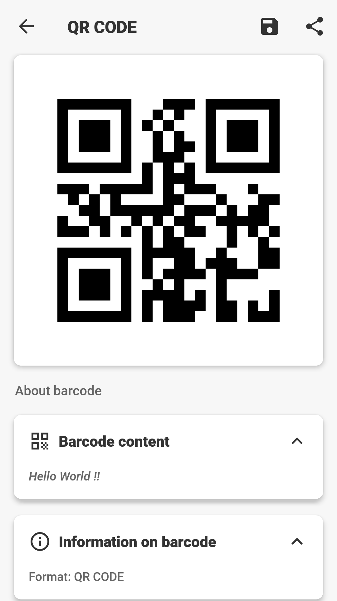
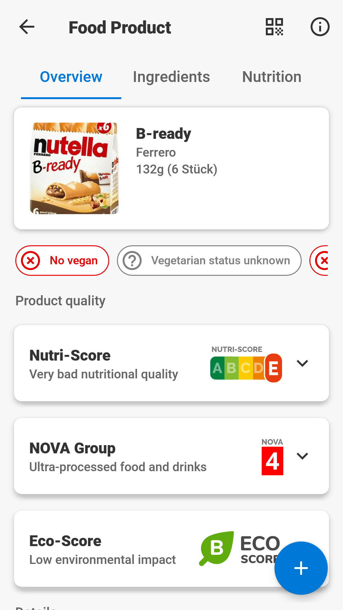
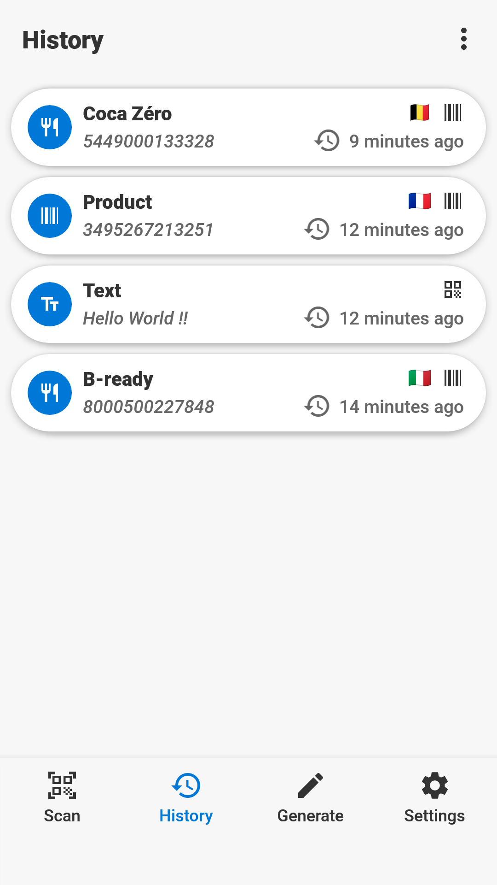
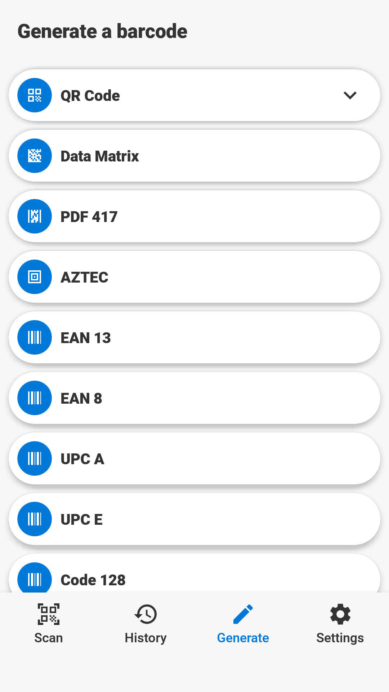
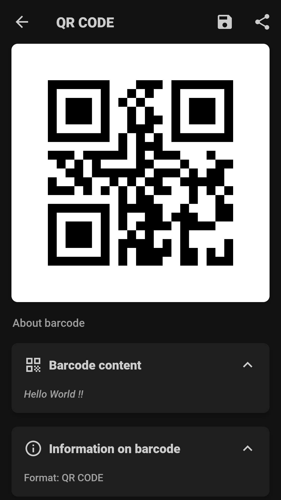
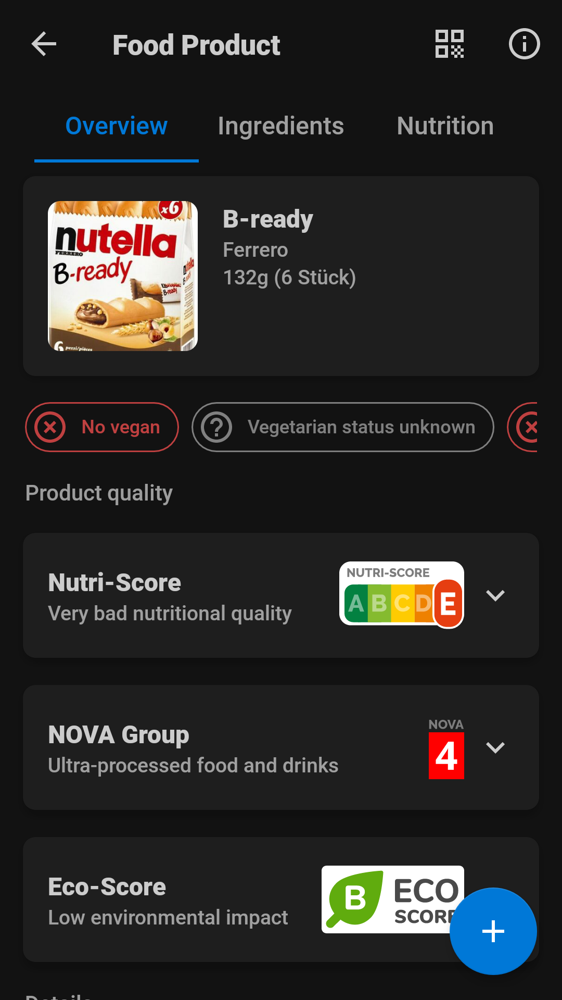
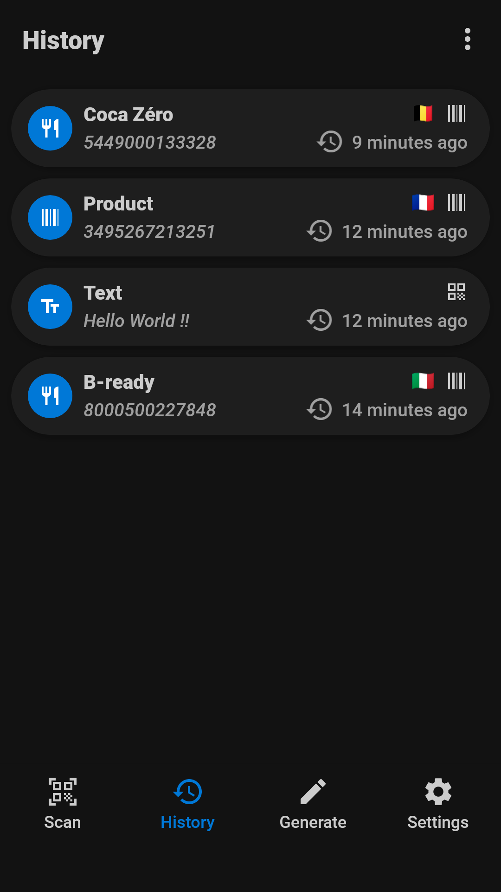
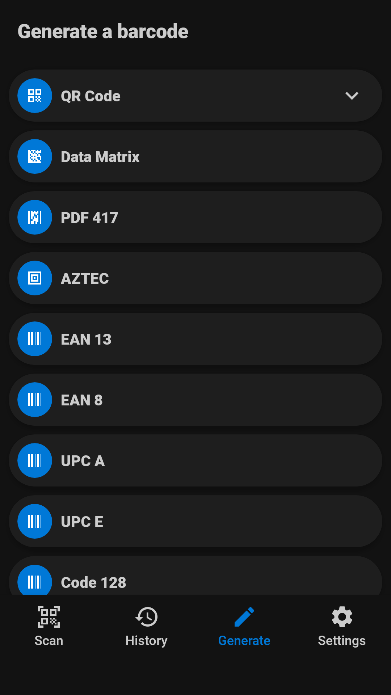

# 
Barcode Scanner

<h4>A libre barcode scanner for Android.</h4>

# Overview

Barcode Scanner is a libre, free and ad-free barcode scanning application for Android.

# Screenshots

# Donate

If you like Atharok Barcode Scanner you can donate via Liberapay.

# Format

- 2D barcode format:
***QR Code, Data Matrix, PDF 417, AZTEC***

- 1D barcode format:
***EAN  13, EAN 8, UPC A, UPC E, Code 128, Code 93, Code 39, Codabar, ITF***

# Services

The application can retrieve information about products:

- Food Products via [Open Food Facts](https://world.openfoodfacts.org/)
- Cosmetic Products via [Open Beauty Facts](https://world.openbeautyfacts.org/)
- Pet Food Products via [Open Pet Food Facts](https://world.openpetfoodfacts.org/)
- Books via [Open Library](https://openlibrary.org/)

# Licences

The code is licensed under the [GPLv3](https://www.gnu.org/licenses/gpl-3.0).

Dependencies:

- [ZXing](https://github.com/zxing/zxing) is licensed under [Apache License 2.0](https://www.apache.org/licenses/LICENSE-2.0) by Zxing
- [ZXing Android Embedded](https://github.com/journeyapps/zxing-android-embedded) is licensed under [Apache License 2.0](https://www.apache.org/licenses/LICENSE-2.0) by JourneyApps
- [ez-vcard](https://github.com/mangstadt/ez-vcard) is licensed under [FreeBSD](https://www.freebsd.org/copyright/freebsd-license/) by Michael Angstadt
- [Android Image Cropper](https://github.com/CanHub/Android-Image-Cropper) is licensed under [Apache License 2.0](https://www.apache.org/licenses/LICENSE-2.0) by CanHub
- [Glide](https://github.com/bumptech/glide) is licensed under [FreeBSD](https://www.freebsd.org/copyright/freebsd-license/) by Bump Technologies
- [GlideToVectorYou](https://github.com/corouteam/GlideToVectorYou) is licensed under [Apache License 2.0](https://www.apache.org/licenses/LICENSE-2.0) by Corouteam
- [Material Components for Android](https://github.com/material-components/material-components-android) is licensed under [Apache License 2.0](https://www.apache.org/licenses/LICENSE-2.0) by Material Components
- [Koin](https://github.com/InsertKoinIO/koin) is licensed under [Apache License 2.0](https://www.apache.org/licenses/LICENSE-2.0) by insert-koin.io
- [Gson](https://github.com/google/gson) is licensed under [Apache License 2.0](https://www.apache.org/licenses/LICENSE-2.0) by Google
- [Retrofit](https://github.com/square/retrofit) is licensed under [Apache License 2.0](https://www.apache.org/licenses/LICENSE-2.0) by Square
- [Room](https://android.googlesource.com/platform/frameworks/support/+/refs/heads/androidx-main/room) is licensed under [Apache License 2.0](https://www.apache.org/licenses/LICENSE-2.0) by Google

Images:

- [Material icons](https://fonts.google.com/icons) are licensed under [Apache License 2.0](https://www.apache.org/licenses/LICENSE-2.0)
- [Images of the flags](https://www.drapeauxdespays.fr) are in the public domain
