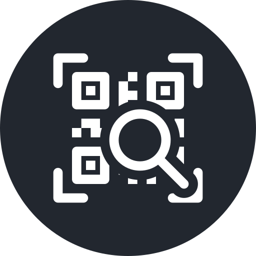
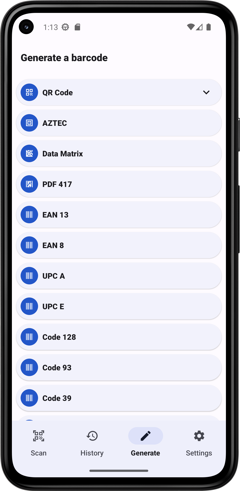
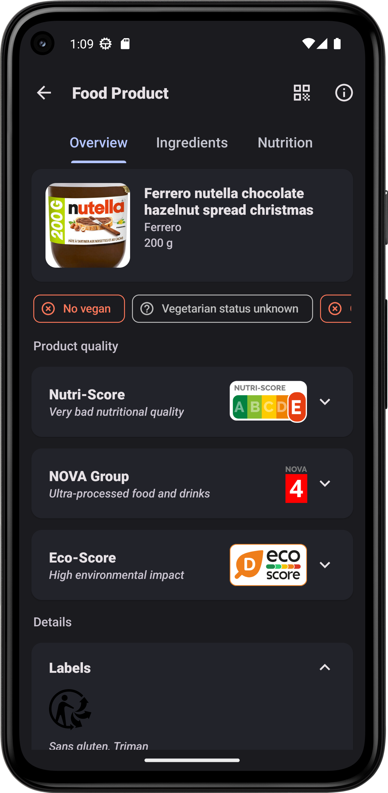
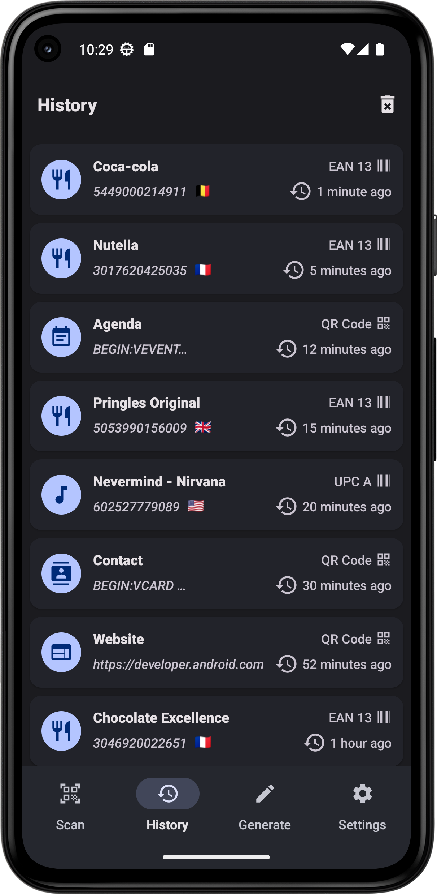
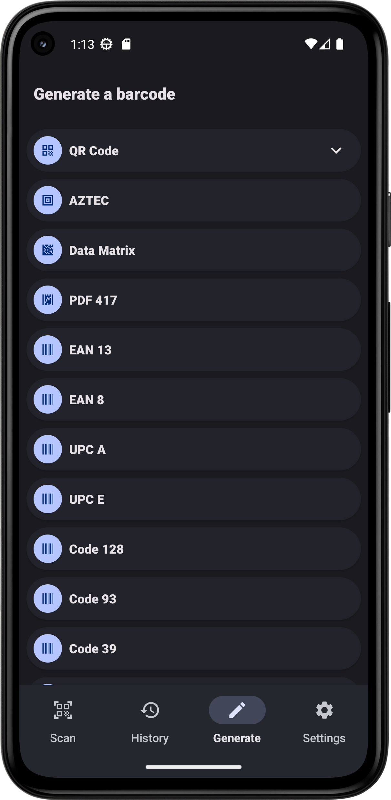

## 
Barcode Scanner

<h4>A free app which allow to read and generate barcodes for Android.</h4>

    
    
    

## Overview

Barcode Scanner is a free and open source app which allow to read and generate barcodes. This app respects your privacy. It does not contain any trackers and does not collect any data.

## Formats

Different barcode formats are supported:

- 2D barcode format: ***QR Code, Data Matrix, PDF 417, AZTEC***
- 1D barcode format: ***EAN 13, EAN 8, UPC A, UPC E, Code 128, Code 93, Code 39, Codabar, ITF***

## Services

Get information about a product during a scan:

- Food Products with [Open Food Facts](https://world.openfoodfacts.org/)
- Cosmetic Products with [Open Beauty Facts](https://world.openbeautyfacts.org/)
- Pet Food Products with [Open Pet Food Facts](https://world.openpetfoodfacts.org/)
- Books with [Open Library](https://openlibrary.org/)
- Music (CDs, Vinyls...) with [MusicBrainz](https://musicbrainz.org/)

## App features

- Simply point your smartphone's camera to a barcode and instantly receive information about it. You can also scan barcodes through a picture in your smartphone.
- With a simple scan, read business cards, add new contacts, add new events to your agenda, open URL or even connect to Wi-Fi.
- Scan Food products barcodes to receive information about their composition thanks to the databases Open Food Facts and Open Beauty Facts.
- Search information about the product you scan, with a quick research on different websites such as Amazon or Fnac.
- Keep track of all your scanned barcodes with the history tool.
- Generate your own barcodes
- Customize the interface with different colours, with a light theme or a dark one. The app integrates the Android 12's features, allowing to adjust colours depending on your wallpaper.
- Texts are entirely translated in English, Spanish, French, German, Polish, Turkish, Russian and Chinese.

## Screenshots

## Donate

If you like Barcode Scanner, you can support me via [Liberapay](https://liberapay.com/Atharok/donate) or [Ko-fi](https://ko-fi.com/atharok).

## Translation

If you want to translate Barcode Scanner, you can use [Weblate](https://hosted.weblate.org/projects/barcodescanner/) or make a merge request.

## Licences

The code is licensed under the [GPLv3](https://www.gnu.org/licenses/gpl-3.0).

Dependencies:

- [ZXing](https://github.com/zxing/zxing) is licensed under [Apache License 2.0](https://www.apache.org/licenses/LICENSE-2.0) by Zxing
- [CameraX](https://android.googlesource.com/platform/frameworks/support/+/refs/heads/androidx-main/camera) is licensed under [Apache License 2.0](https://www.apache.org/licenses/LICENSE-2.0) by Google
- [Code Scanner](https://github.com/yuriy-budiyev/code-scanner) is licensed under [MIT License](https://mit-license.org/) by Yuriy Budiyev
- [ez-vcard](https://github.com/mangstadt/ez-vcard) is licensed under [FreeBSD](https://www.freebsd.org/copyright/freebsd-license/) by Michael Angstadt
- [Android Image Cropper](https://github.com/CanHub/Android-Image-Cropper) is licensed under [Apache License 2.0](https://www.apache.org/licenses/LICENSE-2.0) by CanHub
- [Coil](https://github.com/coil-kt/coil) is licensed under [Apache License 2.0](https://www.apache.org/licenses/LICENSE-2.0) by coil-kt
- [Material Components for Android](https://github.com/material-components/material-components-android) is licensed under [Apache License 2.0](https://www.apache.org/licenses/LICENSE-2.0) by Material Components
- [Koin](https://github.com/InsertKoinIO/koin) is licensed under [Apache License 2.0](https://www.apache.org/licenses/LICENSE-2.0) by insert-koin.io
- [Gson](https://github.com/google/gson) is licensed under [Apache License 2.0](https://www.apache.org/licenses/LICENSE-2.0) by Google
- [Retrofit](https://github.com/square/retrofit) is licensed under [Apache License 2.0](https://www.apache.org/licenses/LICENSE-2.0) by Square
- [Room](https://android.googlesource.com/platform/frameworks/support/+/refs/heads/androidx-main/room) is licensed under [Apache License 2.0](https://www.apache.org/licenses/LICENSE-2.0) by Google

Images:

- [Material icons](https://fonts.google.com/icons) are licensed under [Apache License 2.0](https://www.apache.org/licenses/LICENSE-2.0)
- [Images of the flags](https://www.drapeauxdespays.fr) are in the public domain
